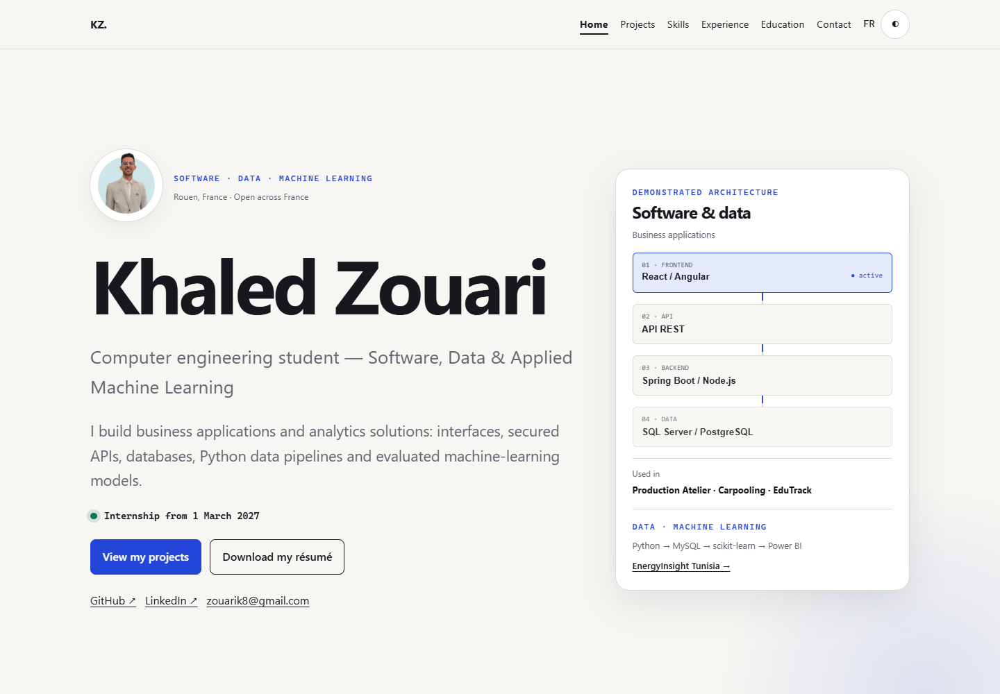

# Portfolio — Khaled Zouari

Portfolio bilingue présentant le parcours, les compétences et les études de cas
de Khaled Zouari, élève ingénieur en informatique : développement logiciel,
analyse de données, Business Intelligence et Machine Learning appliqué.

## Aperçu du portfolio

[Consulter le site](https://khaled-zouari-portfolio.vercel.app/)

Captures de la version publiée, vérifiée le 3 octobre 2026.




## Stack

- Astro 7 et TypeScript strict
- HTML statique avec JavaScript limité aux interactions utiles
- CSS natif et design system par variables
- Vitest pour la logique interactive
- ESLint pour l’analyse statique
- GitHub Actions pour la vérification continue

## Prérequis

- Node.js 22.19 ou supérieur
- npm 10.9 ou supérieur

## Installation

```bash
npm ci
```

Copier `.env.example` vers `.env` et renseigner l’URL canonique :

```dotenv
SITE_URL=https://votre-domaine.example
```

## Développement local

```bash
npm run dev
```

Le site est alors disponible sur `http://localhost:4321`.

## Vérifications

```bash
npm run lint
npm run typecheck
npm test
npm run build
npm run check:links
```

`check:links` s’exécute après le build et contrôle les liens internes des pages
HTML générées.

## Structure

```text
src/
├── components/       composants de page et interaction signature
├── config/           locales et identifiants de routes
├── data/             profil, projets, expériences, formation, compétences
├── layouts/          document HTML, SEO et hreflang
├── lib/              logique testable sans interface
├── pages/            routes françaises et anglaises
└── styles/           design system global
public/               CV, favicon et image Open Graph
scripts/              vérifications de build
```

## Modifier le contenu

Les informations personnelles et professionnelles se trouvent dans `src/data`.
Les composants ne doivent pas contenir de nouvelles affirmations métier. Une
information non vérifiée doit rester hors du site public jusqu’à validation.

Les cinq études de cas principales sont générées depuis `src/data/projects.ts` :

- Production Atelier
- Carpooling Platform
- EduTrack
- EnergyInsight Tunisia — traitement de facturation, Machine Learning et résultats Power BI
- MiniDrawFX

## Internationalisation

- français à la racine du site ;
- anglais sous `/en/` ;
- métadonnées `hreflang` et `x-default` générées par le layout commun.

## Accessibilité

Le projet vise WCAG 2.2 AA : structure sémantique, lien d’évitement, focus
visible, navigation clavier, contrôle accessible du thème, contrastes et prise
en charge de `prefers-reduced-motion`.

Les contrôles automatisés ne remplacent pas une vérification manuelle au
clavier, avec lecteur d’écran et à plusieurs niveaux de zoom.

## Production

Le portfolio est publié sur :

https://khaled-zouari-portfolio.vercel.app

## Deployment

Hébergement : Vercel.

## Build

```bash
npm run build
```

Le dossier de sortie est `dist`.

## Environment

`SITE_URL` contient l’URL canonique de production. Cette variable est configurée
dans Vercel pour les environnements Production et Preview.

## CI/CD

GitHub Actions valide le lint, les types, les tests, le build, les liens et la
sécurité. Vercel doit être relié au dépôt GitHub pour redéployer automatiquement
chaque push sur `main`.

## Déploiement Vercel

1. Importer le dépôt GitHub dans Vercel.
2. Conserver le framework détecté `Astro`.
3. Utiliser `npm run build` comme commande de build.
4. Utiliser `dist` comme dossier de sortie.
5. Ajouter `SITE_URL` avec l’URL Vercel ou le domaine personnalisé final.
6. Déployer, puis vérifier les deux langues, le CV, le sitemap et les liens.

Vercel fournit HTTPS, previews de pull requests et domaine personnalisé. Le site
reste un export statique et peut aussi être hébergé sur Netlify ou GitHub Pages.

Le fichier `public/.well-known/security.txt` expire le 30 septembre 2027 et doit
être renouvelé avant cette date.

## Mesurer Lighthouse

Après déploiement, ouvrir Chrome DevTools → Lighthouse, sélectionner Mobile,
puis exécuter Performance, Accessibility, Best Practices et SEO. Aucun score
n’est revendiqué dans ce dépôt tant qu’une mesure reproductible n’a pas été
enregistrée.

## Confidentialité

- aucun analytics par défaut ;
- aucun cookie applicatif ;
- aucune clé API côté frontend ;
- aucun numéro de téléphone affiché dans les pages ;
- le CV public reste le document fourni par son propriétaire.

## Licence

Aucune licence de réutilisation n’est accordée pour le moment. Tous droits
réservés à Khaled Zouari.
